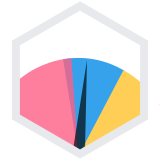

<p align="center"><br></p>
<h3 align="center">Chart.js Gauge</h3>
<p align="center"><strong><code>@byteowls/chartjs-gauge</code></strong></p>

<p align="center">
    
    <a href="https://github.com/moberwasserlechner/chartjs-gauge/actions?query=workflow%3ACI"></a>
    <a href="https://www.npmjs.com/package/@byteowls/chartjs-gauge"></a>
<br>
  <a href="https://www.npmjs.com/package/@byteowls/chartjs-gauge"></a>
  <a href="https://www.npmjs.com/package/@byteowls/chartjs-gauge"></a>
</p>

## Install

```
npm i chart.js @byteowls/chartjs-gauge
```

## Config

```javascript
var ctx = document.getElementById("canvas").getContext("2d");

var chart = new Chart(ctx, {
  type: "gauge",
  data: {
    datasets: [
      {
        value: 65,
        minValue: 0,
        data: [50, 70, 90, 100],
        backgroundColor: ["green", "yellow", "orange", "red"],
      },
    ],
  },
  options: {
    needle: {
      radius: "20%",
      width: "10%",
      length: "80%",
      color: "rgba(0, 0, 0, 1)",
    },
    valueLabel: {
      display: true,
      formatter: (value) => {
        return "$" + Math.round(value);
      },
      color: "rgba(255, 255, 255, 1)",
      backgroundColor: "rgba(0, 0, 0, 1)",
      borderRadius: 5,
      padding: {
        top: 10,
        bottom: 10,
      },
    },
  },
});
```

## License

[MIT](https://opensource.org/licenses/MIT)
